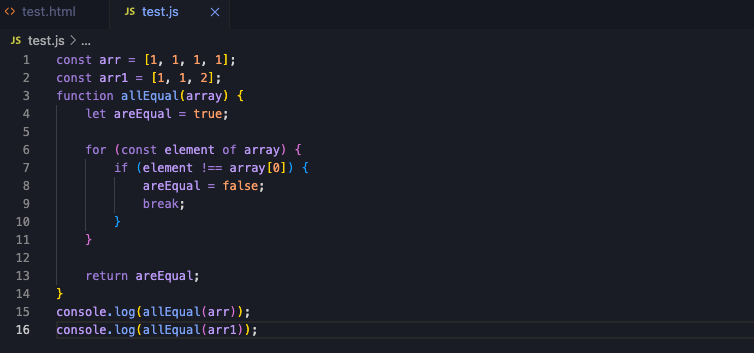

# Crystal Clear Theme for VS Code 🔮

## 📸 Screenshots


A meticulously crafted VS Code theme that combines modern aesthetics with optimal readability. Crystal Clear offers a perfect balance of style and functionality, making your code shine like a perfectly cut gem.

## ✨ Features

- **Optimized Color Harmony**: Carefully selected color palette that reduces eye strain during long coding sessions
- **Smart Contrast**: Strategically designed contrast ratios for maximum readability
- **Semantic Highlighting**: Intuitive color coding for different code elements
- **Modern Aesthetics**: Clean, contemporary design that stays out of your way
- **Accessibility First**: Designed with accessibility in mind, following WCAG guidelines


## 🎨 Color Palette

| Element | Hex Color | Preview |
|---------|-----------|---------|
| Background | `#1a1b26` |  |
| Foreground | `#d4d4d4` |  |
| Accent | `#7aa2f7` |  |
| Strings | `#9ece6a` |  |
| Numbers | `#ff9e64` |  |

## 🚀 Installation

1. Open VS Code
2. Go to Extensions (Ctrl+Shift+X / Cmd+Shift+X)
3. Search for "Crystal Clear Theme"
4. Click Install
5. Press Ctrl+K Ctrl+T / Cmd+K Cmd+T and select "Crystal Clear"

## 🔧 Customization

Want to tweak the theme? Add these to your `settings.json`:

```json
{
  "workbench.colorCustomizations": {
    "[Crystal Clear]": {
      // Your customizations here
    }
  }
}
```

## 📦 Languages Supported

Optimized syntax highlighting for:
- JavaScript/TypeScript
- Python
- HTML/CSS
- React/JSX
- PHP
- Ruby
- Go
- And many more!

## 🤝 Contributing

Love Crystal Clear? Contributions are welcome!

1. Fork the repository
2. Create your feature branch (`git checkout -b feature/amazing-feature`)
3. Commit your changes (`git commit -m 'Add amazing feature'`)
4. Push to the branch (`git push origin feature/amazing-feature`)
5. Open a Pull Request

## 📝 License

This theme is released under the MIT License. See the [LICENSE](LICENSE) file for details.

## 🙌 Credits

Created with ❤️ by [Your Name]

Special thanks to the VS Code theme development community for inspiration and guidance.

---

**Enjoying Crystal Clear?** ⭐ Star us on GitHub and [leave a review](https://marketplace.visualstudio.com/items?itemName=Shellomo.crystal-clear-theme) on the VS Code Marketplace!